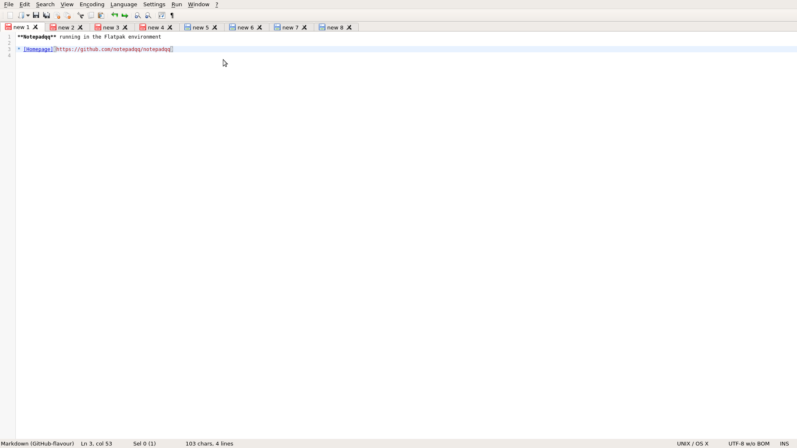

# notepadqq-flatpak

Notepadqq is a text editor designed by developers, for developers.



[Homepage](https://notepadqq.com)

This repo is about flatpak package.

## Instructions

### Requirements

* [flatpak](https://github.com/flatpak/flatpak)
* [flatpak-builder](https://github.com/flatpak/flatpak-builder)

For EL7:

```
# yum install 'flatpak' 'flatpak-builder'
```

You may also wish to install the `xdg-desktop-portal*` packages:

```
# yum install 'xdg-desktop-portal*'
```

See also:

* [flatpak setup](https://flatpak.org/setup)

### Adding repository

```
$ flatpak remote-add --if-not-exists "flathub" "https://dl.flathub.org/repo/flathub.flatpakrepo"
```

See also:

* [flathub setup](http://docs.flatpak.org/en/latest/using-flatpak.html#add-a-remote)

### Prepare

```
$ flatpak install "flathub" "org.kde.Sdk//5.11"
```

```
$ flatpak install "flathub" "org.kde.Platform//5.11"
```

```
$ flatpak install "flathub" "io.qt.qtwebkit.BaseApp//5.11"
```

Clone this repository, then checkout the right branch.

### Build

```
$ flatpak-builder "build" "com.notepadqq.Notepadqq.yaml" --force-clean --install-deps-from="flathub"
```

### Test

```
$ flatpak-builder --run "build" "com.notepadqq.Notepadqq.yaml" "sh"
```

### Test run

```
$ flatpak-builder --run "build" "com.notepadqq.Notepadqq.yaml" "notepadqq"
```

### Create repo

```
$ flatpak-builder --repo="repo" --force-clean "build" "com.notepadqq.Notepadqq.yaml"
```

### Install

```
$ flatpak --user remote-add --no-gpg-verify "notepadqq-qtwebkit" "repo"
```

```
$ flatpak --user install "notepadqq-qtwebkit" "com.notepadqq.Notepadqq"
```

### Run

```
$ flatpak run "com.notepadqq.Notepadqq"
```

### Uninstall

```
$ flatpak --user uninstall "com.notepadqq.Notepadqq"
```

```
$ flatpak --user remote-delete "notepadqq-qtwebkit"
```

### Build single-file bundle

```
$ flatpak build-bundle "repo" "notepadqq.flatpak" "com.notepadqq.Notepadqq" --runtime-repo="https://flathub.org/repo/flathub.flatpakrepo"
```

### Install single-file bundle

If you have already [installed](#install) the package, you have to [uninstall](#uninstall) it before continuing.

```
$ flatpak --user install "notepadqq.flatpak"
```

See also:

* [Building your first Flatpak](http://docs.flatpak.org/en/latest/first-build.html)
* [Single-file bundles](http://docs.flatpak.org/en/latest/single-file-bundles.html#single-file-bundles)

## FAQ

### Does flatpak-ed Notepadqq run as superuser?

[No](https://github.com/flatpak/flatpak/issues/1557). It is a [MATE](https://github.com/mate-desktop)/[marco](https://github.com/mate-desktop/marco) [issue](https://github.com/mate-desktop/marco/issues/301).

### Why not a RPM package?

I already provided a [repo](https://copr.fedorainfracloud.org/coprs/scx/notepadqq/) with RPM packages.

### Why I can't open any file?

Try:

1. install the latest version of `flatpak`
2. install the `xdg-desktop-portal*` packages
3. install the *com.notepadqq.Notepadqq* as a [flatpak package](http://docs.flatpak.org/en/latest/first-build.html#install-the-app)
4. set the [XDG_RUNTIME_DIR](https://github.com/flatpak/flatpak/issues/534#issuecomment-378824515) environment variable: `XDG_RUNTIME_DIR="/run/user/${UID}"`

### How to build an extension?

Go to the extension directory, then:
```
$ flatpak run --command='bash' 'com.notepadqq.Notepadqq' -c 'node /app/share/notepadqq/extension_tools/pack.js . npm'
```

It should create a `*.nqqext` file.

See [notepadqq-extensions](https://github.com/scx/notepadqq-extensions) for details.

### How to install an extension?

1. Select `Extensions`, then `Install extensions`.
2. Select a `*.nqqext` file, then press `Open`. 
3. Press `Install` or `Update`.
4. Press `OK`.
5. Restart **Notepadqq**.

### How do I find my installed extensions?

They should be available from the `Extensions` menu.

All extensions are located in the `~/.var/app/com.notepadqq.Notepadqq/config/Notepadqq/extensions/` directory.

### How to run commands from the host?

Use [flatpak-spawn](http://docs.flatpak.org/en/latest/flatpak-command-reference.html#flatpak-spawn) with the `--host` option.

For example:

```
flatpak-spawn --host cat /etc/os-release
```

### Are you the author of Notepadqq?

No, I only created the flatpak package for it.

See also:

* [GitHub repo](https://github.com/notepadqq/notepadqq)

